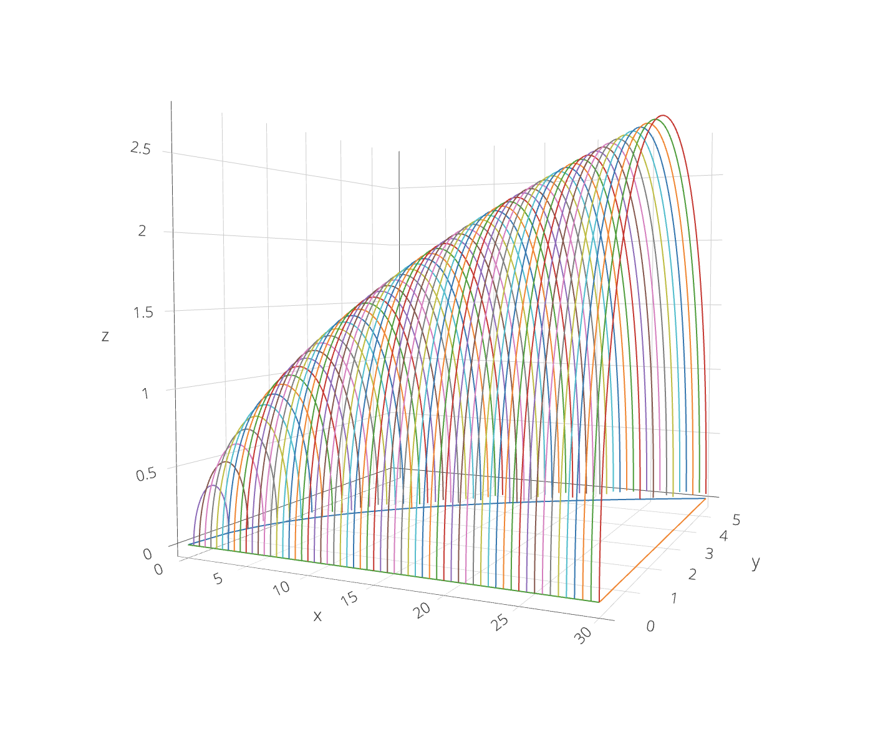

# 3D Cross-section Generation 
A R script to generate cross-sectional slicing visualizations of functions bounded by the x and y axis.



***

## Execution
To run this program, begin by using your favorite editor to edit `config.r`. Inside exists many hyper-parameters which you could use to configure the slicing code. This file includes settings for things like top-bound function (as a user-defined function in that file), cross-section bounds (as before), max-x bounds, and also fidelity of rendering (how many known points are calculated) for both the cross-section and top-bound function. The repository should ship with the function `sqrt(x)` and semicircle cross-sections as sane defaults.

Comments are available to help manage and write each of the parameters.

Once the editing is done, run the R script. Setup your copy of R and `source` the main slicing code.

```r
> source("Plotting.R")
```

Finally, to render the visualization as a manipulatable HTML webpage, simply call the REPL return for `fig`, as in...

```r
> fig
```

in your copy of R.

After a few moments, your default web browser should open with the visualization powered by Plotly. You could pan, scroll, and zoom as usual to manipulate the 3D viewport; hovering over curves could also tell you individual points and their coordinates. 

